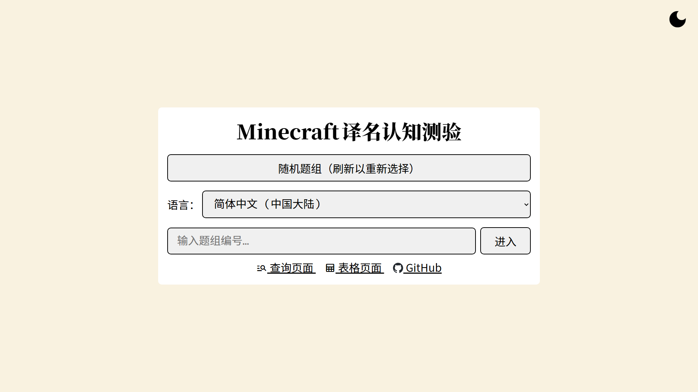

# Minecraft标准译名工具合集

[](https://github.com/SkyEye-FAST/minecraft_translation_flask/actions/workflows/pylint.yml) [](https://github.com/SkyEye-FAST/minecraft_translation_flask/actions/workflows/update.yml)

- **[English](README_en.md) | [中文](README.md)**

----
> [!WARNING]
> **此项目已经弃用，请使用[SkyEye-FAST/minecraft_verdigloss](https://github.com/SkyEye-FAST/verdigloss)代替。**

可查询Minecraft标准译名的简易网页，后端框架使用[Flask](https://github.com/pallets/flask)，前端使用了[jQuery](https://jquery.com/)库。

## 用途

### 主页面

在主页面的输入框内输入需要查询的源字符串内容（即英文原文），点击“查询”按钮，在出现的列表中选择需要查询的字符串键名，再次点击“查询”按钮即可查询相应的译名。

默认只显示中文变种，可以通过“启用其他语言”来切换是否显示日韩越的译名。

#### 样式

网页样式参考[SkyEye-FAST/minecraft_translation_ppt](https://github.com/SkyEye-FAST/minecraft_translation_ppt)，参见[#颜色](#颜色)一节。


### 测验

可以在网站的[`/quiz`子页面](https://mcst.teahouse.team/quiz)找到译名测验小游戏。

题目为从语言文件中随机抽取的10个译名，可以用于测试玩家对标准译名的熟悉程度。




### 翻译表

可以在网站的[`/table`子页面](https://mcst.teahouse.team/table)找到自动生成的翻译表，包括键名、原文和支持的7种语言。

在浏览器中使用自带的页面内搜索功能（快捷键：`Ctrl + F`或`⌘ Command + F`）可以快速检索译名。

此页面在快速检索时非常有用，但并不适合将结果向他人展示。建议使用主页面的截图向他人展示译名情况。


## 运行

参见[Flask文档](https://flask.palletsprojects.com/en/3.0.x/)。

### 依赖项

请使用下面的命令安装依赖项：

``` shell
pip install -r requirements.txt
```

### 环境变量

需要在`.env`或者系统中设置`SECRET_KEY`环境变量，可以使用以下命令生成：

``` shell
python -c 'import secrets; print(secrets.token_hex())'
```

## 说明

### Minecraft语言文件

引用自[SkyEye-FAST/mc_lang](https://github.com/SkyEye-FAST/mc_lang)。

如果希望在自己搭建的实例中使用其他版本的Java版语言文件，请使用[SkyEye-FAST/minecraft_translation](https://github.com/SkyEye-FAST/minecraft_translation)获取。

请将获取到的`en_us.json`、`zh_cn.json`、`zh_hk.json`、`zh_tw.json`、`lzh.json`、`ja_jp.json`、`ko_kr.json`和`vi_vn.json`放置在语言文件文件夹下（默认为与脚本同级的`lang`文件夹，可以在配置文件中调整）。

[`supplements.json`](lang/supplements.json)中存有游戏内语言文件缺失，而Crowdin上已更新的内容。目前项目默认配置为关闭读取此项。

### 日期与时区

网页上显示的日期和时区根据用户的IP决定，相关数据从GeoIP2 GeoLite2数据库获取。

日期和时区的本地化由[`babel`](https://github.com/python-babel/babel)和[`flask-babel`](https://github.com/python-babel/flask-babel)完成。

### 颜色

主页面背景色为 ${\color{#f9f2e0}\blacksquare}$ `#f9f2e0`，并针对不同类别的字符串使用了不同颜色的表格。

下方首先列出的颜色为表格边框颜色；表格背景颜色为80%透明度的边框颜色，叠加页面背景色后的等效颜色以括号在后加注。

- 进度： ${\color{#a02b93}\blacksquare}$ `#a02b93`（ ${\color{#e7cad1}\blacksquare}$ `#e7cad1`）


- 生物群系： ${\color{#4ab5c4}\blacksquare}$ `#4ab5c4`（ ${\color{#d6e6da}\blacksquare}$ `#d6e6da`）


- 方块： ${\color{#5b9bd5}\blacksquare}$ `#5b9bd5`（ ${\color{#d9e1de}\blacksquare}$ `#d9e1de`）


- 状态效果： ${\color{#ffc000}\blacksquare}$ `#ffc000`（ ${\color{#fae8b3}\blacksquare}$ `#fae8b3`）


- 附魔： ${\color{#44546a}\blacksquare}$ `#44546a`（ ${\color{#d5d2c8}\blacksquare}$ `#d5d2c8`）


- 实体： ${\color{#ed7d31}\blacksquare}$ `#ed7d31`（ ${\color{#f7dbbd}\blacksquare}$ `#f7dbbd`）


- 物品： ${\color{#70ad47}\blacksquare}$ `#70ad47`（ ${\color{#dee4c1}\blacksquare}$ `#dee4c1`）


## 反馈

遇到的问题和功能建议等可以提出议题（Issue）。

欢迎创建拉取请求（Pull request）。

## 感谢

[Favicon](static/favicon.ico)和[apple-touch-icon.png](static/apple-touch-icon.png)的原始文件来自[Minecraft Wiki](https://minecraft.wiki/w/File:Favicon.ico)，以CC BY-NC-SA 3.0协议授权。

[`GeoLite2-City.mmdb`](GeoLite2-City.mmdb)来自[P3TERX/GeoLite.mmdb](https://github.com/P3TERX/GeoLite.mmdb)。版权归MaxMind, Inc.所有。
