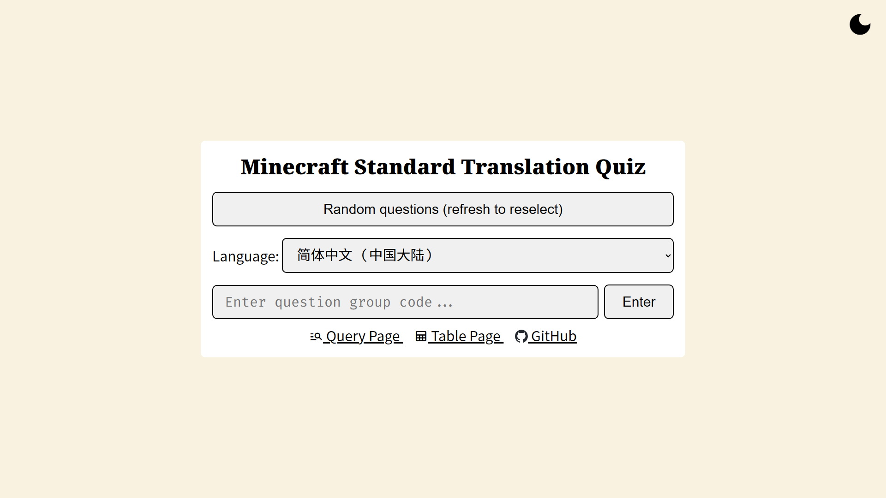

# Minecraft Standard Translation Toolkit

[](https://github.com/SkyEye-FAST/minecraft_translation_flask/actions/workflows/pylint.yml) [](https://github.com/SkyEye-FAST/minecraft_translation_flask/actions/workflows/update.yml) [](https://github.com/SkyEye-FAST/minecraft_translation_flask/actions/workflows/extract_font.yml)

- **[English](README_en.md) | [中文](README.md)**

----

A simple web page for querying Minecraft standard translations, using [Flask](https://github.com/pallets/flask) as the backend framework and [jQuery](https://jquery.com/) for the frontend.

You can view a demo of the webpage at the following URLs:

1. [mcst.teahouse.team](https://mcst.teahouse.team/)
2. [skyeyefast.pythonanywhere.com](https://skyeyefast.pythonanywhere.com/) (Backup site, updates may be slower)

## Purpose

### Main Page

Enter the source string (i.e. the original English text) into the input box on the main page, click the "Query" button, select the desired string key from the resulting list, and click "Query" again to retrieve the corresponding translation.

By default, only Chinese variants are displayed. You can enable other languages (Japanese, Korean, Vietnamese) by toggling the "Enable additional languages" option.

#### Styling

The webpage styling is inspired by [SkyEye-FAST/minecraft_translation_ppt](https://github.com/SkyEye-FAST/minecraft_translation_ppt). Refer to the [#Colors](#colors) section.


### Quiz

A translation quiz game can be found on the [`/quiz` subpage](https://mcst.teahouse.team/quiz) of the website.

It features 10 randomly selected translations from language files, allowing players to test their familiarity with standard translations.




### Translation Table

An autogenerated translation table can be found on the [`/table` subpage](https://mcst.teahouse.team/table) of the website, including keys, original texts, and translations in 7 supported languages.

Use the browser's built-in search function (shortcut key: `Ctrl + F` or `⌘ Command + F`) for quick lookups.

This page is useful for quick searches, but not suitable for presenting results to others. Consider using screenshots from the main page to showcase translations.


## Running

See [Flask documentation](https://flask.palletsprojects.com/en/3.0.x/) for details.

### Dependencies

Install dependencies using the following command:

``` shell
pip install -r requirements.txt
```

### Environment Variables

Set the `SECRET_KEY` environment variable either in `.env` or system settings. Generate it using:

``` shell
python -c 'import secrets; print(secrets.token_hex())'
```

## Notes

### Minecraft Language Files

Referenced from [SkyEye-FAST/mc_lang](https://github.com/SkyEye-FAST/mc_lang).

For other versions of Java Edition language files in your own instance, use [SkyEye-FAST/minecraft_translation](https://github.com/SkyEye-FAST/minecraft_translation).

Place `en_us.json`, `zh_cn.json`, `zh_hk.json`, `zh_tw.json`, `lzh.json`, `ja_jp.json`, `ko_kr.json`, and `vi_vn.json` in the language files folder (default: `lang` folder alongside the script, configurable in settings).

[`supplements.json`](lang/supplements.json) contains updates from Crowdin for missing in-game language files. This feature is disabled by default.

### Fonts

This project uses Source Han Serif and an automatically constructed subset of [I.Ming](https://github.com/ichitenfont/I.Ming).

The repository automatically checks for updates to I.Ming subsets every Thursday 🕐 01:00 (UTC+8, UTC Wednesday 🕔 17:00) based on Classical Chinese content.

This process uses the script [`extract_font.py`](extract_font.py) and requires [`fonttools`](https://github.com/fonttools/fonttools).

### Date and Timezone

Date and timezone on the webpage are based on user's IP, sourced from GeoIP2 GeoLite2 database.

Localization of date and timezone is handled by [`babel`](https://github.com/python-babel/babel) and [`flask-babel`](https://github.com/python-babel/flask-babel).

### Colors

The main page background color is ${\color{#f9f2e0}\blacksquare}$ `#f9f2e0`, and tables with different colored strings for different categories are used.

Below are the colors listed, first being the table border color; the table background color is the border color with 20% opacity, annotated with the equivalent color after overlaying the page background color in parentheses.

- Advancements: ${\color{#a02b93}\blacksquare}$ `#a02b93` (${\color{#e7cad1}\blacksquare}$ `#e7cad1`)


- Biomes: ${\color{#4ab5c4}\blacksquare}$ `#4ab5c4` (${\color{#d6e6da}\blacksquare}$ `#d6e6da`)


- Blocks: ${\color{#5b9bd5}\blacksquare}$ `#5b9bd5` (${\color{#d9e1de}\blacksquare}$ `#d9e1de`)


- Effects: ${\color{#ffc000}\blacksquare}$ `#ffc000` (${\color{#fae8b3}\blacksquare}$ `#fae8b3`)


- Enchantments: ${\color{#44546a}\blacksquare}$ `#44546a` (${\color{#d5d2c8}\blacksquare}$ `#d5d2c8`)


- Entities: ${\color{#ed7d31}\blacksquare}$ `#ed7d31` (${\color{#f7dbbd}\blacksquare}$ `#f7dbbd`)


- Items: ${\color{#70ad47}\blacksquare}$ `#70ad47` (${\color{#dee4c1}\blacksquare}$ `#dee4c1`)


## Feedback

Please feel free to raise issues for any problems encountered or feature suggestions.

Pull requests are welcome.

## Acknowledgments

Original files for [Favicon](static/favicon.ico) and [apple-touch-icon.png](static/apple-touch-icon.png) are from [Minecraft Wiki](https://minecraft.wiki/w/File:Favicon.ico), licensed under CC BY-NC-SA 3.0.

Classical Chinese font [I.Ming](https://github.com/ichitenfont/I.Ming) is licensed under [IPA Open Font License v1.0](https://github.com/ichitenfont/I.Ming/blob/master/LICENSE.md).

[`GeoLite2-City.mmdb`](GeoLite2-City.mmdb) is from [P3TERX/GeoLite.mmdb](https://github.com/P3TERX/GeoLite.mmdb), copyright MaxMind, Inc.
